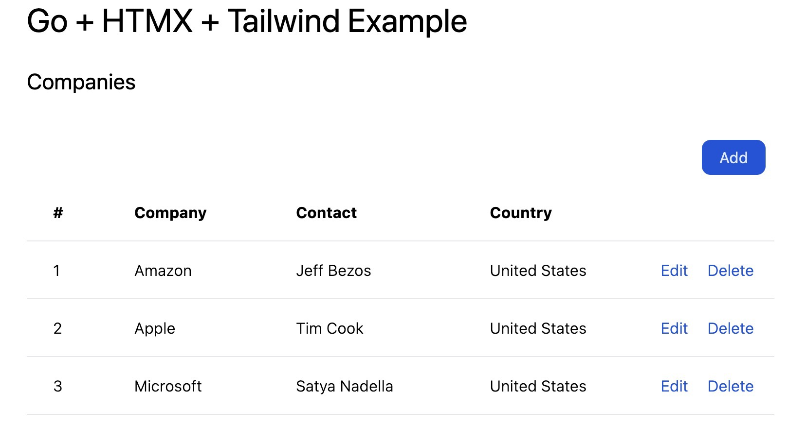

# go-htmx-tailwind-example

Example CRUD app written in Go + HTMX + Tailwind CSS

This project implements a pure dynamic web app with SPA-like features but without heavy complex Javascript or Go frameworks to keep up with.  Just HTML/CSS + Go ❤️




## Develop

```
 Choose a make command to run

  init          initialize project (make init module=github.com/user/project)
  vet           vet code
  test          run unit tests
  build         build a binary
  dockerbuild   build project into a docker container image
  start         build and run local project
  css           build tailwindcss
  css-watch     watch build tailwindcss
```
